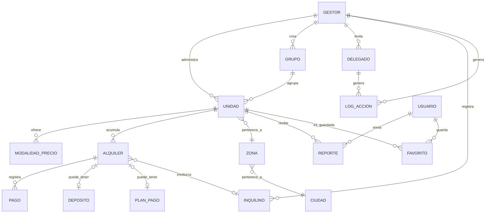

# Marketplace Inmobiliario — Documento Base de Producto y Arquitectura

> Documento único de referencia, resultado de una sesión de diseño completa. Es la fuente de verdad para arrancar el repo (`TFI\marketplace-inmobiliario`) y para que cualquier persona o herramienta (Antigravity, Claude Code) entienda el sistema antes de tocar código. Se complementa con `CONTEXT.md` (glosario de dominio) y `ADR-candidatos.md` (decisiones arquitectónicas justificadas) — no los duplica, los referencia.
>
> **Fuera de alcance de este documento**: UI/UX Design y Design System (colores, tipografía, componentes) — no se tomó ninguna decisión visual en esta sesión; se define aparte con mockups reales.
>
> **Supuestos marcados explícitamente** (no se cerraron con un número exacto en la sesión): días de prueba = 7 (ajustable), moneda del precio = ARS.

---

## 1. Resumen del producto

Plataforma que permite a dueños y administradores de inmuebles (edificios, cabañas, casas quinta, salones de eventos, canchas, etc.) publicar y administrar sus propiedades en alquiler, y a usuarios buscarlas y contactar directamente a quien las gestiona. Arranca en Goya, Corrientes, Argentina, sin descartar expansión geográfica futura. La plataforma **nunca procesa ni retiene el dinero del alquiler** entre el Gestor y el usuario final — es una herramienta de gestión y descubrimiento, no una pasarela de pagos entre partes. El negocio se sostiene cobrándole al Gestor una suscripción mensual por cada Unidad que administra.

Todo lo definido en esta sesión es **alcance de V1** — no hay funcionalidades diferidas a una versión posterior; esto es una decisión explícita del negocio, documentada en la sección 12.

---

## 2. PRD — Alcance funcional

### 2.1 Actores

| Actor | Descripción |
|---|---|
| **Usuario** | Cualquier cuenta registrada. Puede buscar, contactar Gestores y guardar favoritos. |
| **Gestor** | Un Usuario se convierte en Gestor al crear su primera Unidad. No es un tipo de cuenta separado. Puede ser el dueño del inmueble o un tercero (ej. una inmobiliaria). |
| **Delegado** | Persona con acceso limitado a la cuenta de un Gestor. Necesita cuenta propia ya registrada y verificada. |
| **Equipo (dev dashboard)** | Alta/baja de cuentas, gestión de pagos (incluido efectivo), moderación, soporte. |
| **Inquilino** | Registro interno del Gestor sobre a quién le alquila. No es una cuenta de la plataforma. |

Ver definiciones completas de cada entidad de dominio en `CONTEXT.md`.

### 2.2 Funcionalidades por actor

**Usuario / buscador**
- Buscar Unidades sin necesidad de cuenta (wizard de 3 preguntas: tipo → zona → precio/duración, omitible) + filtros avanzados (capacidad, fechas) estilo Mercado Libre.
- Ver ficha de una Unidad: fotos (hasta 10), descripción, ubicación aproximada, modalidades de precio, calendario de disponibilidad.
- Registrarse (obligatorio) para: ver ubicación exacta, contactar al Gestor (WhatsApp directo o chat interno), guardar favoritos.
- Reportar una publicación (solo usuarios registrados y logueados).

**Gestor**
- Crear/editar Unidades con esquema flexible por categoría (departamento, cabaña, salón, cancha, etc.).
- Agruparlas opcionalmente en Grupos (ej. un edificio) sin efecto en el precio.
- Publicar o mantener en gestión privada, indistintamente (factura igual).
- Definir múltiples modalidades de precio por Unidad.
- Gestionar el calendario de disponibilidad manualmente.
- Registrar Alquileres (con historial acumulado), Pagos, Depósitos, y opcionalmente un Plan de pago con seguimiento de atrasos.
- Registrar Inquilinos (agenda propia, no depende de que usen la plataforma).
- Subir contrato PDF (opcional) por Alquiler.
- Invitar Delegados con alcance y permiso configurables.
- Filtrar y ordenar su cartera de Unidades por nombre, Grupo, estado (incluye Archivada/Bloqueada), categoría/tipo, y por próximo vencimiento de contrato.
- Ver métricas y exportar registros de Alquileres/pagos (ver detalle en 2.4).
- Facturar (opcional) a sus propios inquilinos vía AFIP.
- Autoservicio: subir su Cupo en cualquier momento.

**Delegado**
- Acceso a lo que el Gestor le habilite: alcance (cuenta completa / un Grupo / Unidades sueltas) × permiso (Ver / Gestionar — nunca Facturación).

**Equipo (dev dashboard)**
- Alta de cuentas con Cupo pre-asignado (quedan auto-validadas, sin OTP).
- Confirmación manual de pagos en efectivo/transferencia.
- Bajar el Cupo de un Gestor.
- Moderación: cola priorizada, revisión de reportes, suspender/restaurar publicaciones.
- Soporte básico de cuentas.

### 2.3 Reglas de negocio clave

- **Unidad** es la entidad de facturación, 1:1, publicada o no.
- **Cupo**: $9.900 ARS por Unidad/mes (asumido), con descuentos por tramos de volumen (ej. ~10% desde cierto volumen, ~15% en el tramo superior — los umbrales exactos quedaron como ejemplo ilustrativo en la sesión, a definir con precisión antes de lanzar) sobre el total de la cuenta, no por Grupo.
- **Sin plan gratis permanente**: prueba temporal de ~7 días con máximo 3 Unidades.
- Subir el Cupo es autoservicio, con cobro prorrateado inmediato. Bajarlo pasa por el dev dashboard, aplica en el próximo ciclo, sin reembolso.
- Al bajar el Cupo: auto-archivado excluyendo siempre Unidades con un Alquiler activo, ordenando el resto por fecha de creación más reciente primero. Si no alcanza, el sistema avisa al Gestor para que decida manualmente.
- **Cooldown de 15 días** entre archivar y desarchivar una misma Unidad — evita rotar más Unidades de las que se pagan.
- **El Gestor decide manualmente el uso operativo día a día de sus Unidades** (publicar, pausar, marcar alquilada). El sistema sí mueve estado automáticamente, pero solo en 4 casos ya definidos: (1) el calendario público se bloquea al registrar una Seña, (2) el archivado al bajar el Cupo (excluyendo siempre Unidades con Alquiler activo), (3) el paso a Bloqueada por impago al vencer el período de gracia, y (4) el paso a En revisión al llegar a 50 reportes.
- **Impago**: reintento automático de Mercado Pago 2 veces en 2 días. Al tercer día sin pago: se archivan todas las Unidades y la cuenta queda completamente deshabilitada para gestionar — incluidos Alquileres en curso con inquilinos reales (decisión explícita del negocio: "no hay excusas válidas para no pagar en 3 días").
- **Moderación**: a los 50 reportes de usuarios registrados y logueados, la Unidad pasa automáticamente a **En revisión** (oculta, prioridad en cola); un moderador humano confirma Suspendida o la restaura sin marca.
- **Contacto**: registro obligatorio para ver datos de contacto. Enlace directo de WhatsApp (`wa.me` con mensaje prellenado, sin costo ni API) y chat interno conviven como canales independientes — el usuario elige.
- **Ubicación**: pin aproximado público, exacto solo tras login.
- **Notificaciones**: solo push in-app + email. Nunca WhatsApp para avisos del sistema (solo para el link de contacto). Los avisos con impacto en plata o acceso a la cuenta (impago, invitación de Delegado, contrato por vencer, atraso de Inquilino) van siempre por ambos canales, sin poder desactivarse.
- **i18n**: marketplace público, panel del Gestor y landing Pro en español/portugués/inglés (enfoque SEO/turismo, no expansión de negocio todavía). Auto-traducción de publicaciones vía API con opción de edición manual por idioma. Dev dashboard solo en español.
- **Sin reseñas** en V1 (modelo tipo Marketplace de Facebook: solo reportes + moderación).
- **Borrado lógico** en todos los niveles (Unidad individual y cuenta completa): desaparece de la vista del Gestor, se conserva internamente por métricas históricas y obligaciones contables/impositivas. Ver nota legal en sección 8.
- **Fricción al eliminar, distinta según el alcance**: eliminar una Unidad individual pide solo un modal de confirmación normal (no hay límite técnico a la cantidad de Unidades creadas, es una cuestión de orden para el Gestor). Eliminar la cuenta completa pide confirmación por teléfono (OTP) y, si tiene Alquileres activos en ese momento, una advertencia explícita antes de confirmar ("tenés N Unidades con inquilinos activos, esto las va a despublicar de inmediato") — no bloquea la acción, solo informa la consecuencia.
- **Aviso al guardar "Alquilada" sin fecha ni contrato**: si el Gestor marca ese estado sin cargar un Alquiler con fechas ni PDF, el sistema le avisa que sin esos datos no va a poder notificarle sobre vencimientos o renovación — el guardado igual se completa, es solo informativo.

### 2.4 Métricas (detalle)

- **Por Unidad**: vistas de la publicación, cantidad de solicitudes de contacto recibidas (directo + chat interno), cantidad de usuarios que la guardaron como favorito.
- **Por cuenta**: Unidades activas vs. archivadas, próximos vencimientos de contrato, historial de pagos/facturación.
- **Financieras**: cantidad de alquileres (histórico y activos), cuánto ganó por Unidad — con cortes por rango de fechas (mes/año/personalizado), por Unidad individual, y por Grupo. Presentadas como gráfico de barras (tendencia) + tabla filtrable (detalle), no solo números sueltos.
- **Exportación**: sí, para los registros de Alquileres/pagos (CSV/Excel, uso contable real). No para las métricas de performance del marketplace (vistas, contactos, favoritos) en V1 — se evalúa más adelante si hay uso real de esos datos primero.

---

## 3. User Flows principales

**Alta de cuenta y verificación**
1. Usuario se registra con teléfono (OTP obligatorio, sin excepciones) o con Google.
2. Si viene de Google, el email se autocompleta; si no, lo tipea y lo confirma — el email es obligatorio en ambos casos.
3. Cuenta activa como Usuario. Se convierte en Gestor automáticamente al crear su primera Unidad.

**Publicar una Unidad**
1. Gestor crea la Unidad (vista de gestión: categoría, atributos, datos internos, contrato PDF opcional).
2. Opcionalmente completa la vista de marketplace (título, hasta 10 fotos, ubicación exacta, descripción, modalidades de precio, contacto WhatsApp/Instagram).
3. Auto-traducción a los otros 2 idiomas, editable a mano.
4. Publica → visible en el marketplace, cuenta para el Cupo desde que se creó (no desde que se publicó).

**Contactar a un Gestor**
1. Usuario ve una Unidad, hace clic en el ícono de WhatsApp/Instagram o "chatear".
2. Si no está registrado, se le pide registro antes de completar la acción.
3. WhatsApp → redirige a `wa.me` con mensaje prellenado ("Buenas, estoy interesado en alquilar [Unidad]..."). Chat interno → el Gestor recibe la solicitud y decide aceptar o no la conversación.

**Ciclo de vida de un Alquiler**
1. Gestor marca la Unidad como "No disponible/Alquilada" (independiente de cargar un Alquiler formal).
2. Opcionalmente crea un registro de Alquiler: fechas inicio/fin (editable/extendible), contrato PDF opcional, Depósito opcional, Plan de pago opcional.
3. Si hay Seña, el calendario público bloquea esas fechas automáticamente.
4. Registra Pagos (Seña/Pago/Saldo) a lo largo del tiempo, sin límite de cantidad.
5. Si definió Plan de pago, el sistema avisa atrasos contra la fecha de vencimiento esperada — a Gestor y Delegados con permiso Gestionar.
6. Al vencer la fecha de fin, nada cambia automáticamente; el contrato se muestra "Vencido" en la ficha interna.

**Cambio de Cupo**
1. Subir: el Gestor lo hace desde su panel, cobro prorrateado inmediato, actualiza la suscripción en Mercado Pago.
2. Bajar: vía dev dashboard, aplica en el ciclo siguiente, dispara el auto-archivado según las reglas de la sección 2.3.

**Invitar un Delegado**
1. Gestor va a "Agregar colaborador", ingresa el email de una cuenta ya registrada y verificada.
2. Si el email no matchea ninguna cuenta, error directo.
3. El invitado recibe una notificación in-app y acepta.
4. Gestor configura alcance (cuenta completa / Grupo / Unidades sueltas) y permiso (Ver / Gestionar).

**Moderación por reportes**
1. Usuario registrado reporta una Unidad.
2. Al llegar a 50 reportes → estado "En revisión" automático, oculta, prioridad en cola de moderación.
3. Moderador humano decide: confirma "Suspendida" o restaura sin marca.

---

## 4. Roles y Permisos

| Rol | Alcance configurable | Nivel de permiso | Facturación |
|---|---|---|---|
| Usuario | — | Buscar, contactar, favoritos | No aplica |
| Gestor (dueño) | Toda su cuenta | Total | Sí — único que puede cambiar Cupo, ver log completo, facturar |
| Delegado | Cuenta completa / un Grupo / Unidades sueltas | Ver o Gestionar | Nunca |
| Equipo (dev dashboard) | Global | Alta/baja de cuentas, pagos, moderación, soporte | Gestiona la facturación de la plataforma hacia los Gestores |

- El **Log de acciones** registra Gestor y Delegados por igual (crear/editar/archivar/desarchivar/eliminar Unidad, publicar/pausar, subir/editar contrato, aceptar/rechazar chat, invitar/quitar Delegado) — visible solo para el Gestor dueño.
- Candidato de implementación: Row Level Security de Postgres/Supabase para modelar alcance × permiso directamente en la base, en vez de resolverlo a mano en cada endpoint (ver ADR 0009).

---

## 5. Arquitectura del sistema

### 5.1 Stack

| Capa | Tecnología | Notas |
|---|---|---|
| Marketplace público + landing Pro | Next.js (SSR/SSG) | Indexable por Google, 3 idiomas con rutas `/es/` `/pt/` `/en/` + hreflang |
| App | Capacitor, WebView delgado sobre el sitio Next.js | No se duplica UI (ver ADR 0001) |
| Panel del Gestor | Next.js, web-only | No se empaqueta con Capacitor |
| Backend / lógica de negocio | NestJS en Railway | Cupo, Alquileres, moderación, notificaciones, orquestación de AFIP y Mercado Pago |
| Auth + Base de datos + Storage | Supabase (Postgres) | Reemplaza a Neon para este proyecto puntual (ver ADR 0009); RLS para permisos |
| Frontend hosting | Vercel (plan comercial) | Asumido por consistencia con Next.js y con Turnos TPI — no se confirmó como pregunta separada. Requerido plan comercial porque el uso no es personal |
| Pagos | Mercado Pago + Mercado Pago Suscripciones | Autodébito para tarjeta; confirmación manual desde dev dashboard para efectivo/transferencia |
| Facturación AFIP | Librería open source `afip-apis` (Node/TS) | WSAA + WSFEv1, sin proveedor pago (ver ADR 0006) |
| Geolocalización | OpenStreetMap + Leaflet + Nominatim | Sin costo de licencia; evaluar self-host o proveedor de volumen si escala (ver ADR 0007) |
| Notificaciones push | Firebase Cloud Messaging | Gratis |
| Email transaccional | Proveedor con capa gratuita (ej. Resend) conectado al SMTP de Supabase Auth | El SMTP compartido de Supabase alcanza para pruebas, no para producción |
| OTP por SMS | Twilio / MessageBird / Vonage, vía Supabase Auth | Costo variable por mensaje — inevitable, dado el requisito de verificación obligatoria |
| Traducción automática | API tipo DeepL/Google Translate | Capa gratuita cubre el volumen inicial |
| Starter de referencia | Template oficial `with-supabase` (Next.js + Supabase, MIT) | Punto de partida gratuito para no armar auth desde cero |

### 5.2 Superficie de API (por recurso, no por endpoint)

El diseño exacto de rutas/métodos es trabajo de implementación, no de esta sesión. Los grupos de recursos que el backend necesita cubrir:

`Auth` (signup/login, OTP, invitaciones de Delegado) · `Unidades` (CRUD, estados, atributos dinámicos) · `Grupos` · `Modalidades de precio` · `Alquileres` (+ Pagos, Depósitos, Plan de pago) · `Inquilinos` · `Cupo` (upgrade/downgrade, sincronía con Mercado Pago) · `Facturación` (AFIP, plataforma→Gestor y Gestor→Inquilino) · `Búsqueda/Filtros` · `Favoritos` · `Chat interno` · `Reportes/Moderación` · `Notificaciones` · `Métricas` (por Unidad, por cuenta, exportación) · `Log de acciones` · `Zonas` (catálogo por Ciudad) · `Dev dashboard` (todo lo anterior con alcance global).

---

## 6. Database Schema / ERD (primer nivel lógico)

**Notas de campos** (nivel lógico, tipos y constraints exactos son implementación):
- `Unidad`: categoría + JSON de atributos dinámicos, estado (enum de la sección 2.3), fechas de creación/archivado.
- `Alquiler`: fecha_inicio, fecha_fin (siempre definidas, editables), contrato_pdf_url (opcional).
- `Pago`: monto, fecha, método (texto libre), tipo (Seña/Pago/Saldo), nota opcional.
- `Depósito`: monto_total, monto_retenido, monto_devuelto, motivo opcional.
- `PlanPago`: monto_esperado, frecuencia, día_máximo_tolerado.
- `Delegado`: alcance (cuenta/grupo/unidad + referencia), permiso (Ver/Gestionar).
- `Zona`: nombre, ciudad_id — catálogo cargado desde dev dashboard.

---

## 7. Integraciones externas

| Servicio | Propósito | Costo |
|---|---|---|
| Mercado Pago + Suscripciones | Cobro del Cupo (autodébito tarjeta) | Comisión por transacción (~0,8%–1,24% + IVA según medio; mayor con tarjeta de crédito) |
| AFIP (vía `afip-apis`) | Facturación plataforma→Gestor y Gestor→Inquilino (opt-in) | Gratis; costo operativo de gestionar certificados |
| OpenStreetMap / Leaflet / Nominatim | Mapa y geocoding | Gratis; ojo con la política de uso del servidor público de Nominatim a escala |
| Firebase Cloud Messaging | Push notifications | Gratis |
| Proveedor de email (Resend u otro) | Confirmación de cuenta, notificaciones críticas | Capa gratuita cubre el volumen inicial |
| Twilio/MessageBird/Vonage (vía Supabase Auth) | OTP por SMS | Variable por mensaje, sin forma de evitarlo |
| DeepL / Google Translate API | Auto-traducción de publicaciones | Capa gratuita cubre el volumen inicial |
| Google OAuth | Login alternativo | Gratis |

---

## 8. Seguridad y privacidad

- **Verificación**: teléfono + OTP obligatorio sin excepciones para altas propias; cuentas creadas por el dev dashboard quedan auto-validadas (excepción intencional). Email obligatorio siempre, confirmado si no viene de Google.
- **Sin verificación de identidad** para publicar (no se pide DNI/escritura) — moderación reactiva vía reportes, como se documentó en la sección 2.3.
- **Ley 25.326** (Protección de Datos Personales, Argentina): aplica porque el Gestor carga datos de terceros (Inquilinos) sin que estos hayan interactuado con la plataforma. Requiere consentimiento informado — se resuelve con un checkbox/aviso al cargar un Inquilino ("declaro contar con su autorización..."). El derecho de supresión se cumple sobre borrado lógico, salvo lo que la ley obliga a retener por motivos contables/impositivos (facturas y pagos asociados), que queda aislado y sin uso — esto debe quedar explícito en los Términos y Condiciones, no prometido como "borrado total sin excepción".
- **Permisos**: Delegados nunca acceden a Facturación ni al Log de acciones completo (solo el Gestor dueño lo ve).
- **Moderación**: umbral de 50 reportes de usuarios registrados/logueados (no anónimos) para evitar abuso del sistema de reportes.

---

## 9. Deployment / Infraestructura

| Pieza | Dónde vive |
|---|---|
| Marketplace público + landing Pro (Next.js) | Vercel (plan Pro, uso comercial) |
| Panel del Gestor (Next.js) | Vercel, mismo proyecto o subdominio, web-only |
| App | Build de Capacitor (WebView) → Google Play (USD 25 pago único) y, si se suma iOS más adelante, App Store (USD 99/año) |
| Backend (NestJS) | Railway |
| Auth + Base de datos + Storage | Supabase |
| Dominio | A definir, ~USD 10-15/año |

---

## 10. Modelo de negocio / Pricing

- $9.900 ARS por Unidad/mes (asumido — confirmar moneda), publicada o no.
- Descuentos por tramos de volumen sobre el total de la cuenta (ejemplo ilustrativo dado en la sesión: ~10% y ~15% en tramos superiores — umbrales exactos a definir).
- Prueba temporal (~7 días, ajustable) con máximo 3 Unidades, sin plan gratis permanente.
- La landing Pro muestra la tabla de precios completa y las capacidades del sistema desde el primer momento, en los 3 idiomas.

---

## 11. Roadmap / MVP

**Todo lo definido en este documento es V1.** No hay funcionalidades diferidas a una v1.1 — decisión explícita del negocio tomada dos veces durante la sesión de diseño, incluyendo piezas que originalmente se habían sugerido posponer (el CRM de Inquilinos con seguimiento de atrasos, y la facturación Gestor→Inquilino).

---

## 12. Referencias

- Glosario de dominio completo: `CONTEXT.md`
- Decisiones arquitectónicas justificadas (ADR 0001–0009, incluida la de Supabase reemplazando a Neon): `ADR-candidatos.md`
